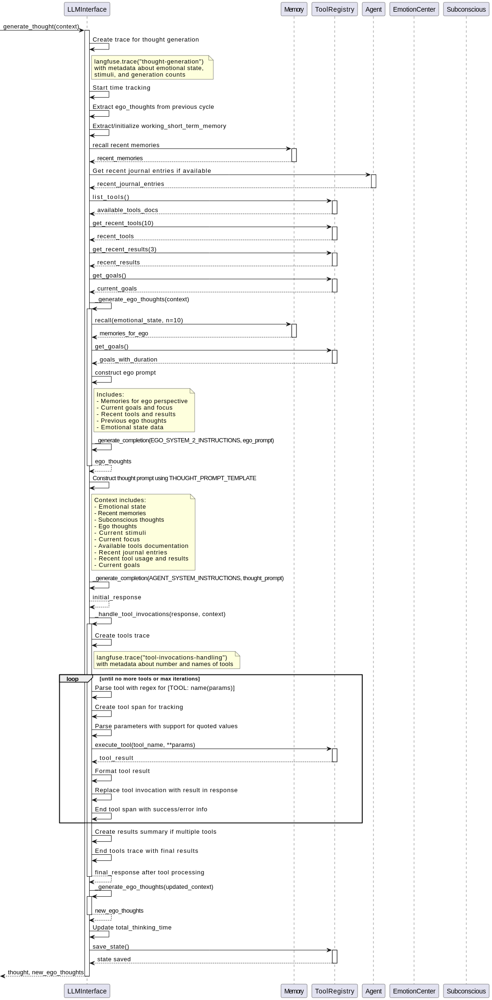

# AI Agent Execution Flow Diagrams

This directory contains PlantUML sequence diagrams that illustrate the execution flow of the AI agent architecture:

1. `agent_execution_flow.txt` - The main agent execution flow
2. `thought_processing_cycle.txt` - Detailed view of the thought generation process

These diagrams focus on:

1. Overall agent processing cycle
2. Ego and normal thought processing
3. Tool usage and handling
4. Memory management
5. Emotional processing

## Components

### Key Components in the Architecture

- **Agent**: The main agent that processes external stimuli and manages the thinking process
- **Mind**: The central cognitive component that orchestrates subcomponents
- **EmotionCenter**: Manages emotional states that influence decision making
- **Subconscious**: Processes background thoughts, associations, and surface memories
- **Conscious**: Handles deliberate thinking based on stimuli and subconscious input
- **LLMInterface**: Interface to the Large Language Model that generates thoughts
- **Memory**: Stores and retrieves memories with emotional associations
- **ToolRegistry**: Registry of tools that can be invoked by the agent

## Execution Flow Summary

1. Client sends stimuli to the Agent
2. Agent forwards the stimuli to the Mind, which creates a trace for the cognitive cycle
3. Mind updates the emotional state based on stimuli
4. Subconscious processes related memories, generates random thoughts, and processes emotions
5. Conscious component prepares context for thinking, including emotional state, memory, and previous ego thoughts
6. LLMInterface generates thoughts through a process of:
   - Preparing context with recent memories and tool information
   - Generating ego-perspective thoughts for meta-cognition
   - Generating main thought response
   - Handling any tool invocations in a loop until complete
   - Generating updated ego thoughts after tool processing
7. Emotional implications of thoughts are extracted and used to update the emotional state
8. Thoughts are stored in memory and used to update the subconscious last thought
9. Final action is determined by the Conscious component
10. Agent updates its physical state and returns the result to the client

## Viewing the Diagrams




To render the sequence diagrams:

1. Install PlantUML: https://plantuml.com/
2. Run the following command:
   ```
   plantuml *.txt
   ```
3. Open the generated PNG files to view the diagrams

Alternatively, use an online PlantUML viewer:
1. Copy the contents of the .txt file
2. Paste into an online PlantUML editor like https://www.planttext.com/

## Special Features of the Architecture

### Ego Processing
The architecture includes a higher-level "ego" perspective that analyzes the agent's actions from a meta-cognitive level. This helps prevent thought loops and provides emotional regulation. Ego thoughts are generated before and after the main thought process, allowing for reflection on the agent's behavior.

### Tool Invocation Loop
The diagrams illustrate how tool invocations are handled in a loop. When tools are detected in a response, they are executed, and the context is updated with the results. New responses are generated that incorporate these results until no more tool calls are detected or a maximum number of iterations is reached.

### Emotional Processing
Emotions are an integral part of the architecture, affecting memory recall, thought generation, and decision making. The EmotionCenter maintains various emotions with different decay rates and intensities, which influence the agent's behavior and physical state.

### Memory Management
The system includes sophisticated memory management with emotional associations for more humanlike recall patterns. Both short-term and long-term memory are maintained, with relevant memories surfaced based on emotional state and query relevance.

### Physical State
The agent maintains a physical state (energy, health) that is updated based on emotional state and activities. This creates a feedback loop between physical and emotional components of the agent. 